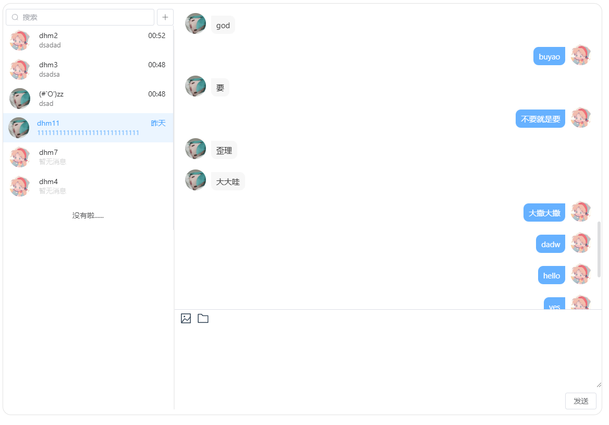

# 智学速练 (SmartStudySwift)

## 项目起源

我在做兼职老师的时候，发现很多学生没有科学的学习方法，比如他们没有科学的做题练习体系，这样会浪费很多时间，而且他们获取知识的方式非常有限。想起我自己以前学习时也是这样摸石头过河，而后面我又接触了像力扣，极客时间这样优秀的平台，于是我就在想，能不能开发一个平台为学生提供科学的练习方式和方便的学习资源，再结合现在流行的AI的方式进一步提升学习效率。所以，我就有了写这个项目想法。

## 项目目标

简单来说，“智学速练”就是想要帮助学生们更好地练习和学习。我们希望通过这个平台：

- **让学习变得更高效**。通过科学的练习方式巩固知识，可以快捷的获取学习资料。
- **创建一个大家都能交流的地方**。学生可以在这里提问、讨论。
- **让学习变得更有趣**。我们会有一些小游戏和奖励机制，比如积分换礼物，让大家觉得学习也是件快乐的事。
- **关注学生的全面发展**。除了学习课本上的知识，我们还会有一些关于艺术、体育等方面的活动，让孩子们的兴趣更加广泛。

## 项目预览

### 聊天模块

